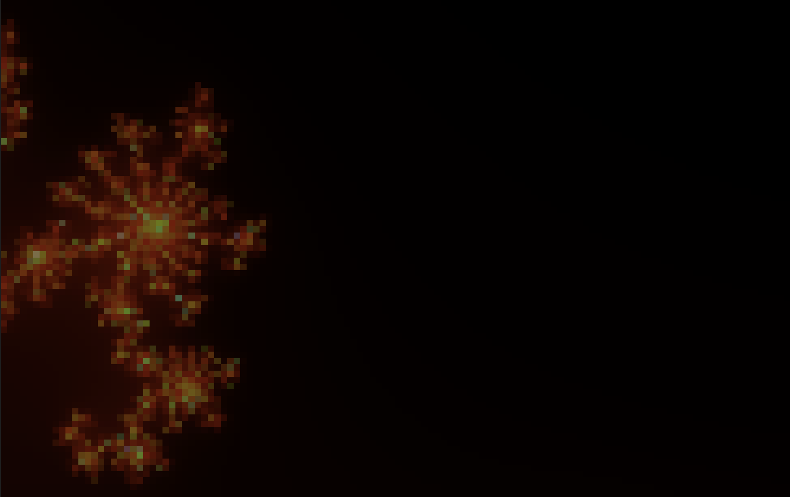
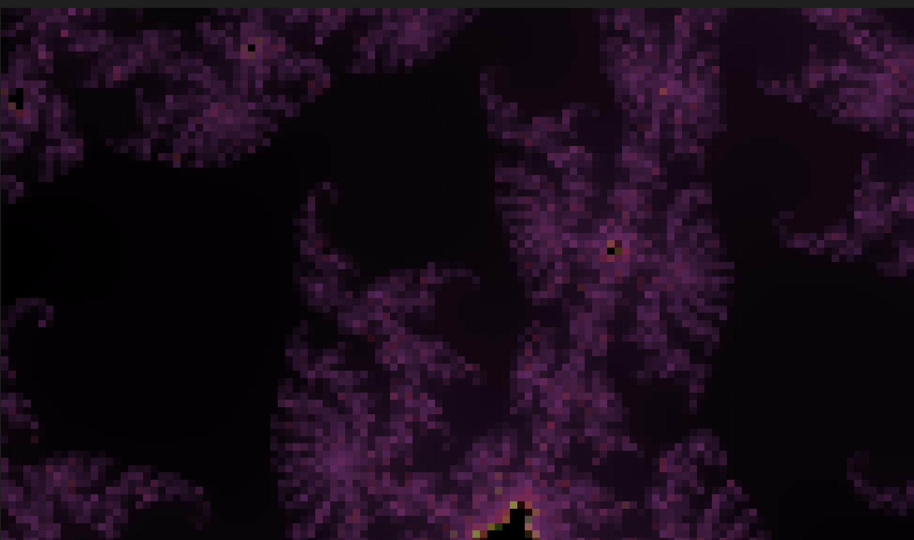

# fractals

Simple fractal generation. Nothing special, no fireworks. I like fractals and I used this project for learning purposes of FFI between Python and Rust (PyO3).

Renders Mandelbrot and Julia set fractals directly in the terminal using Unicode half-block characters and 24-bit color.
The heavy computation is done in a Rust extension module (`fractal_engine`) via PyO3, with a pure Python fallback if the native module is not built.

## Examples






## How to run

Requires Python 3.13+ and [uv](https://docs.astral.sh/uv/).

Build the Rust engine and run:

```
cd engine
uv run maturin develop --release
cd ..
uv run python main.py
```

Without the Rust engine (pure Python fallback, much slower):

```
uv run python main.py
```

Each run generates a random fractal with a random color palette.
