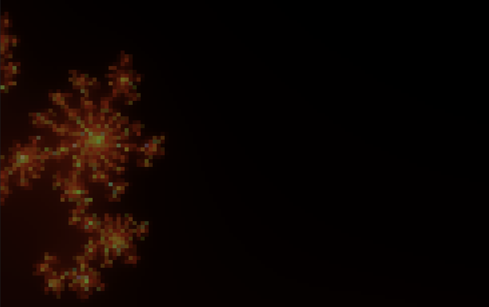
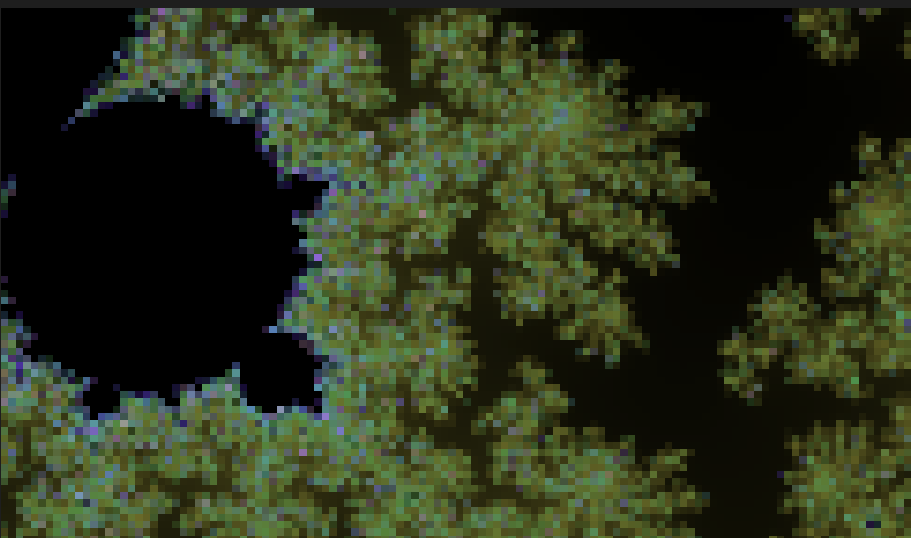
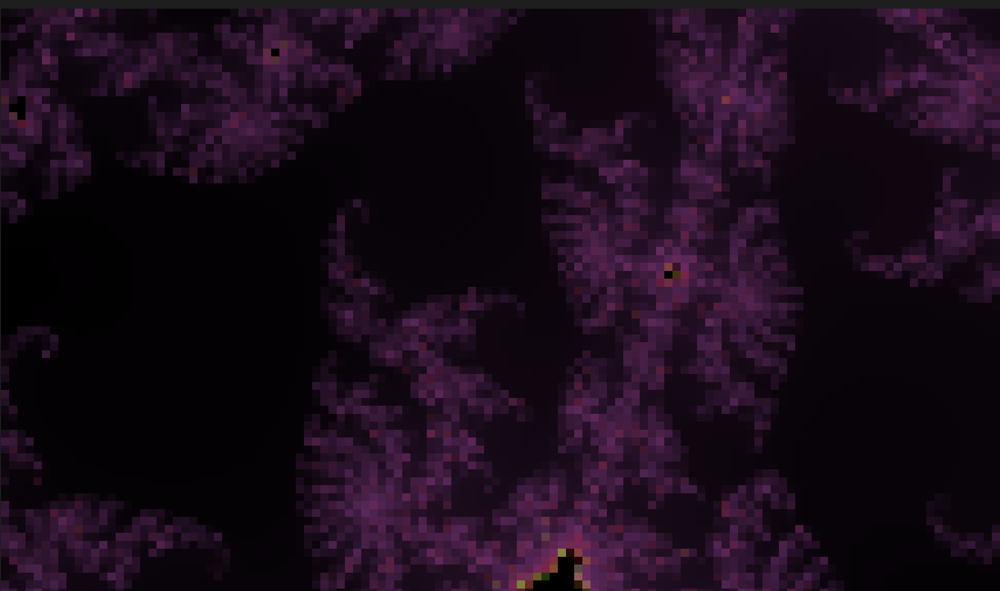

# fractals

Simple fractal generation. Nothing special, maybe a few fireworks. I like fractals and I used this project for learning purposes of FFI between Python and Rust (PyO3).

Renders Mandelbrot, Julia, Burning Ship and Tricorn fractals directly in the terminal using Unicode half-block characters and 24-bit color.
The heavy computation is done in a Rust extension module (`fractal_engine`) via PyO3, with a vectorized NumPy fallback that produces bit-identical results if the native module is not built.

## Examples







## How to run

Requires Python 3.13+, [uv](https://docs.astral.sh/uv/) and a Rust toolchain.

Build the Rust engine and run:

```
uv run maturin develop --release -m engine/Cargo.toml
uv run python main.py
```

Without the Rust engine (NumPy fallback, slower but identical output):

```
uv run python main.py
```

Each run picks a random interesting spot on a random fractal with a random color palette.

```bash
uv run python main.py --animate                    # fly into the fractal
uv run python main.py --fractal burning-ship      # a specific fractal
uv run python main.py --fractal tricorn --animate
uv run python main.py --seed 1234567890            # replay a specific render
uv run python main.py --animate --duration 10 --fps 30
```

## Options

```
--fractal {random,mandelbrot,julia,burning-ship,tricorn}
--animate            fly into the spot instead of a static render (Julia: orbit c)
--duration SECONDS   animation length (default: 6.0)
--fps FPS            animation frame rate cap (default: 24.0)
--seed N             RNG seed; every render prints its seed so you can replay it
```

Found something pretty? The seed printed under the render reproduces it (in a terminal of the same size):

```
uv run python main.py --seed 1234567890 --animate
```

## Development

```
uv run ruff check .              # lint
uv run ruff format .             # format
cargo clippy --manifest-path engine/Cargo.toml
```
